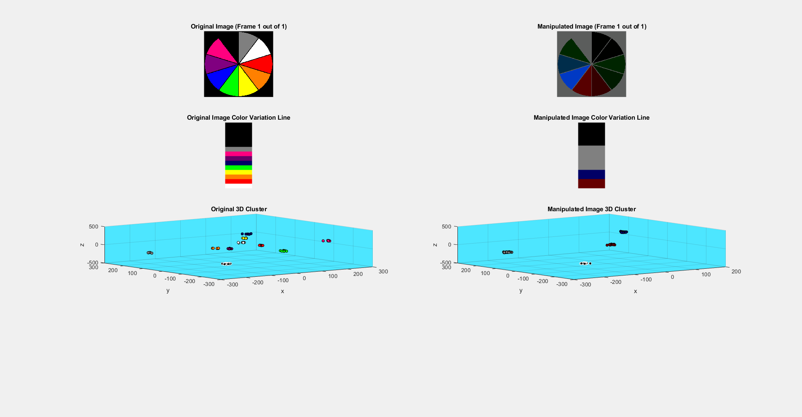
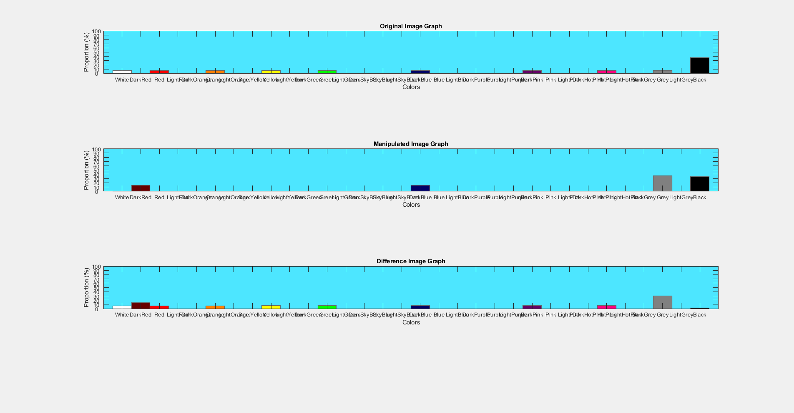
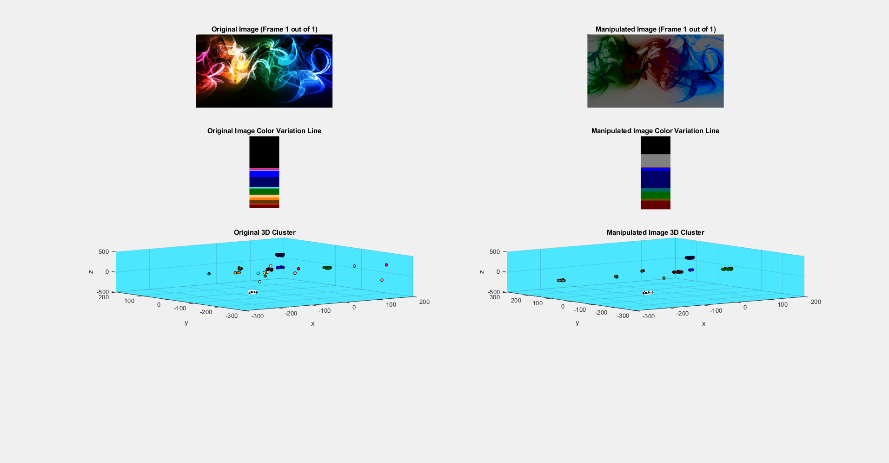

# Color Animation
###### Official CIS111B Final Project by [Shane Staret](https://github.com/SStaret43), [Yao Sedzro](https://github.com/Yensedzro), and [Trush Patel](https://github.com/trushpatel1997). Created through the use of MATLAB, Java, and Arduino.

###### Before this all started, we didn’t even know how to write a single line of code in MATLAB, but through perseverance, hard work, and most importantly all the help we got on the way we were able to make an awesome project.
###### *We'd like to thank [Theodore Gray](http://home.theodoregray.com/), [Professor Kendall Martin](http://lelejiktenkye.blogspot.com/), and [Professor Robert Moyer](http://faculty.mc3.edu/rmoyer/) for helping us throughout this project, if it wasn’t for them none of this would have been possible.*
________________________________________________________________________________________________________________________________

#### We give a run down of what we have done for the past six weeks and present our code output within [this short video](https://www.youtube.com/watch?v=CgzbIqppAzo). On the flipside, this is a [*very* in depth video](https://www.youtube.com/watch?v=NfeG2EDdjmE) explaining every line of our MATLAB code (doesn't show the final code but it is similar). 
* [YouTube channel](https://www.youtube.com/channel/UCmQA16swmtPa29pRo9YtRTA)
* [JavaDoc](https://sstaret43.github.io/ColorAnimation/)
* [Google Hangouts Conversation](https://hangouts.google.com/group/vYaHYCTixmCaNGMp1) NOTE: You will join the conversation and will be able to read all previous messages we sent
* [Freedcamp Page](https://freedcamp.com/CIS_111B_Final_Proje_sX0/A_Project_IzH/todos)
________________________________________________________________________________________________________________________________

#### Essentially, our Color Animation project takes any image or video (in an appropriate format) and grabs each individual pixel. From there, we can determine the RGB values of each pixel and then deduce the proportion of each color. We used 32 colors ranging from navy blue, to ultra light pink in order to show distinct color variations of an image or film. We also manipulated each frame so that it is composed of different colors and then deduced the proportions of the manipulated image as well. We presented our data in color lines, bar graphs, and three-D clustering plots.

#### MATLAB was the programming language we used to process each frame. Every individual figure produced by MATLAB was sent to Java within a folder and then Java presented these figures within a GUI after the video/image was finished processing in MATLAB. The reason we did this was due to the fact that java was more time efficient in showing our results, it was faster, and a lot of clearer as shown in our video. The color proportions of each frame were also determined in MATLAB, then sent to Java through a text file, as we wanted to use Java to manipulate the Arduino. With the Arduino, we programmed a servo to move to certain positions depending on which color had the greatest proportion within a frame.
________________________________________________________________________________________________________________________________

## **Project Manager: Yao Sedzro**
   * ###### created project timeline for all six weeks
   * ###### directed group in specific direction
   * ###### ensured we were all doing our part of the project in a timely manner
   * ###### searched for different communication/documentation tools
   * ###### set up and planned meetings
   * ###### communicated with those in power or others who we needed help/advice from
   * ###### obtained access to equipment (arduinos and raspberry pis)
   * ###### created design document
   * ###### edited final project video
   * ###### helped with code whenever possible
   
   
## **Documenter: Trush Patel**
   * ###### created *detailed* documentation of what was accomplished every week
   * ###### described every individual task that we had done throughout the project
   * ###### researched APIs that could be used within MATLAB/Java
   * ###### researched practical applications of our project
   * ###### designed the initial prototype of our project and GUI
   * ###### tested code and asked for help with code on forums (Reddit, Stack Overflow, etc.)
   * ###### created portion code that would allow Java to manipulate an Arduino
   * ###### created code to manipulate Arduino with Arduino code.
   * ###### helped comment code for MATLAB and Java, and completely commented code for Arduino
   * ###### created the Arduino section of our final video
   
   
## **Lead Programmer: Shane Staret**
   * ###### managed FreedCamp Page and GitHub Page
   * ###### created all MATLAB code
   * ###### tested, designed, and implemented new code
   * ###### asked for help with code on forums (Reddit, Stack Overflow, etc.)
   * ###### created video describing all code
   * ###### created most of Java code
     * ###### implemented code that would allow MATLAB and Java to communicate through text files
     * ###### created code that would specifically manipulate the Arduino based on color proportions obtained from MATLAB
   * ###### created GitHub Pages website
   * ###### created JavaDoc
   * ###### commented code for MATLAB and Java
   * ###### created MATLAB and Java section of our final video
________________________________________________________________________________________________________________________________
## **Pictures & Examples**

#### The (admittedly poor quality) GIFs below show an example of a video ran through our program. In the first GIF, the top left shows each frame in the video and you can see the color line get longer as the GIF proceeds because it is processing more frames of the video.The top right shows the manipulated frame and the two bottom plots are the 3D cluster plots, where the amount of dots of a specific color are determined by their proportion in each frame. So, if the image is 20% black, then there will be 20 dots in the 3D cluster plot. In the second GIF are the bar graphs for the original and manipulated frame. Obviously, the more a color appears in the frame, the larger the bar of that color is in the bar graph.

#### The images below are examples of pictures that ran through our program. The layout is identical to the GIFs above.

